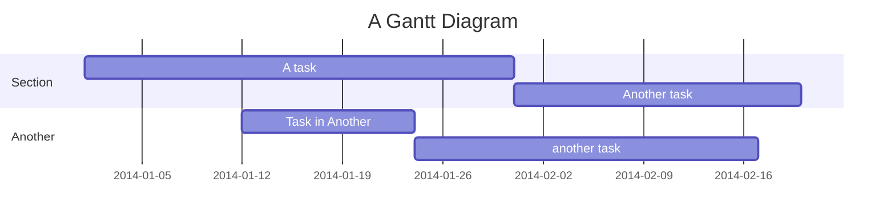

---
{"dg-publish":true,"permalink":"/my-first-note/"}
---


# This normal

## asdlkjasd

###H3 klasjdlkas

 ```swift
 let x = 1
 let y = 2
 let z = x * y
 print(z)
 ```

 




[[1-1 Print\|1-1 Print]]